# Fantastic — Arquitetura de Sistema

Plataforma de venda de conteúdo adulto (+18) com três tipos de usuários:
**Criadores**, **Assinantes/Fãs** e **Anunciantes**. Comissão de 20% sobre transações
de criadores + receita direta de publicidade.

## 1.1 — Diagrama Completo (Mermaid)

```mermaid
graph TD
    %% =======================================================
    %% CLIENTES
    %% =======================================================
    subgraph "Cliente"
        Browser["Browser Web<br/>(Next.js Client)"]
        MobilePWA["PWA Mobile<br/>(iOS/Android)"]
        AdminUI["Painel Admin<br/>(Next.js)"]
    end

    %% =======================================================
    %% BORDA / CDN / WAF
    %% =======================================================
    subgraph "Edge / CDN"
        Cloudflare["Cloudflare<br/>WAF + DDoS + CDN"]
    end

    %% =======================================================
    %% APLICAÇÃO
    %% =======================================================
    subgraph "Camada de Aplicação"
        NextApp["Next.js 15 (App Router)<br/>SSR/SSG + RSC"]
        NestAPI["NestJS API<br/>(REST + WebSocket)"]
        AdminAPI["Admin API<br/>(NestJS sub-app)"]
    end

    %% =======================================================
    %% DOMÍNIO / DADOS
    %% =======================================================
    subgraph "Persistência e Cache"
        Postgres[("Supabase PostgreSQL<br/>via Prisma ORM")]
        Redis[("Redis<br/>Sessões, RateLimit, PubSub")]
        S3[("Cloudflare R2 / AWS S3<br/>Mídia + Documentos KYC")]
    end

    %% =======================================================
    %% SERVIÇOS EXTERNOS
    %% =======================================================
    subgraph "Serviços Externos"
        Mux["Mux<br/>Streaming HLS + DRM<br/>+ Server-Side Watermark"]
        CCBill["CCBill / SegPay<br/>Gateway de Pagamento"]
        Pix["API Pix<br/>(SegPay BR)"]
        SumSub["SumSub<br/>KYC / Verificação de Idade"]
        Resend["Resend / SendGrid<br/>E-mails Transacionais"]
        Sentry["Sentry<br/>Monitoramento de Erros"]
        Grafana["Grafana + Prometheus<br/>Métricas + Logs"]
    end

    %% =======================================================
    %% FLUXOS PRINCIPAIS
    %% =======================================================

    %% Cliente -> Edge
    Browser -- "HTTPS/TLS 1.3" --> Cloudflare
    MobilePWA -- "HTTPS/TLS 1.3" --> Cloudflare
    AdminUI -- "HTTPS (mTLS opcional)" --> Cloudflare

    %% Edge -> Aplicação
    Cloudflare -- "HTTPS" --> NextApp
    Cloudflare -- "HTTPS (REST)" --> NestAPI
    Cloudflare -- "WSS (Socket.IO)" --> NestAPI
    Cloudflare -- "HTTPS" --> AdminAPI

    %% Frontend <-> Backend
    NextApp -- "REST/JSON (server-side fetch)" --> NestAPI
    NextApp -- "REST (client-side)" --> NestAPI

    %% Backend -> Dados
    NestAPI -- "TCP 5432 (Prisma)" --> Postgres
    NestAPI -- "TCP 6379 (ioredis)" --> Redis
    NestAPI -- "S3 API (Signed URLs)" --> S3
    AdminAPI -- "TCP 5432" --> Postgres
    AdminAPI -- "TCP 6379" --> Redis

    %% Backend -> Externos
    NestAPI -- "HTTPS REST + Webhooks" --> CCBill
    NestAPI -- "HTTPS REST" --> Pix
    NestAPI -- "HTTPS REST + Webhook (HMAC)" --> Mux
    NestAPI -- "HTTPS REST + Webhook" --> SumSub
    NestAPI -- "SMTP/HTTPS" --> Resend
    NestAPI -- "HTTPS" --> Sentry
    NestAPI -- "Prometheus scrape" --> Grafana

    %% Webhooks de retorno
    CCBill -- "Webhook HTTPS HMAC" --> NestAPI
    Mux -- "Webhook HTTPS HMAC" --> NestAPI
    SumSub -- "Webhook HTTPS HMAC" --> NestAPI

    %% Streaming direto
    Mux -- "HLS (m3u8) via CDN" --> Browser
    S3 -- "URLs Pré-assinadas" --> Browser

    %% Pub/Sub Chat
    NestAPI <-- "Redis Pub/Sub<br/>(escala horizontal)" --> Redis

    classDef client fill:#1e293b,stroke:#7c3aed,color:#f5f5f5
    classDef edge fill:#0f172a,stroke:#ec4899,color:#f5f5f5
    classDef app fill:#141414,stroke:#7c3aed,color:#f5f5f5
    classDef data fill:#0a0a0a,stroke:#10b981,color:#f5f5f5
    classDef external fill:#1e1e1e,stroke:#f59e0b,color:#f5f5f5

    class Browser,MobilePWA,AdminUI client
    class Cloudflare edge
    class NextApp,NestAPI,AdminAPI app
    class Postgres,Redis,S3 data
    class Mux,CCBill,Pix,SumSub,Resend,Sentry,Grafana external
```



## 1.2 — Protocolos de Comunicação

| Origem → Destino | Protocolo | Observação |
|---|---|---|
| Browser → Cloudflare | HTTPS (TLS 1.3) | Obrigatório HSTS preload |
| Cloudflare → Next.js | HTTPS | Cabeçalho `cf-connecting-ip` |
| Next.js → NestJS | HTTPS REST | JSON, com JWT no header |
| Browser → NestJS (Chat) | WSS (Socket.IO) | Auth via JWT no handshake |
| NestJS → PostgreSQL | TCP 5432 (TLS) | Pool via Prisma + PgBouncer |
| NestJS → Redis | TCP 6379 (TLS) | ioredis com sentinel/cluster |
| NestJS → S3/R2 | HTTPS S3 API | Signed URLs (TTL curto) |
| NestJS → Mux | HTTPS REST | Server-Side Watermark |
| NestJS ↔ Pagamento | HTTPS REST + Webhook HMAC | CCBill/SegPay |
| NestJS ↔ Workers | Redis Pub/Sub | Escala horizontal de chat |

## 1.3 — Camadas de Clean Architecture

```
src/
├── domain/             # Entidades + Value Objects (sem dependências externas)
├── application/        # Casos de uso + portas (interfaces)
├── infrastructure/     # Adaptadores: Prisma, Redis, S3, gateways
├── presentation/       # Controllers, gateways WS, DTOs (HTTP)
└── shared/             # Tipos, helpers, exceções
```

## 1.4 — Próximos Passos

- [ ] Modelagem de eventos de domínio (DomainEvents)
- [ ] Definir SLOs/SLIs de cada serviço externo
- [ ] Implementar circuit breaker (Resilience4j-equivalente em Node)
- [ ] Threat Model STRIDE para fluxo de pagamento
- [ ] Diagrama de sequência para cada fluxo crítico
